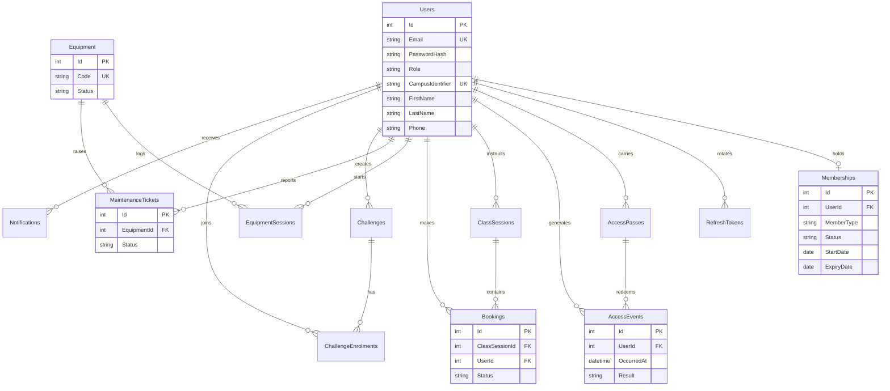

# Emeris Pulse data model

Azure SQL stores operational data for the member, instructor, and admin apps. A person has one login (`Users`) and at most one gym membership. An instructor keeps the Instructor role and may also hold a personal membership, which is how they enter the gym as a member.

Status values are enforced with check constraints.

- User role: Student, Staff, Instructor, GymAdmin, FacilityManager, SystemAdmin
- Membership: Pending, Active, Frozen, Expired. Member type is Student (about 120 days) or Staff (about 365 days)
- Booking: Booked, Waitlisted, Cancelled, Attended, Absent. One row per member per class
- Equipment: Available, OutOfService
- Maintenance ticket: Open, InProgress, Closed

Indexes used by the live screens: access events by time, bookings by class and status, equipment by status.
